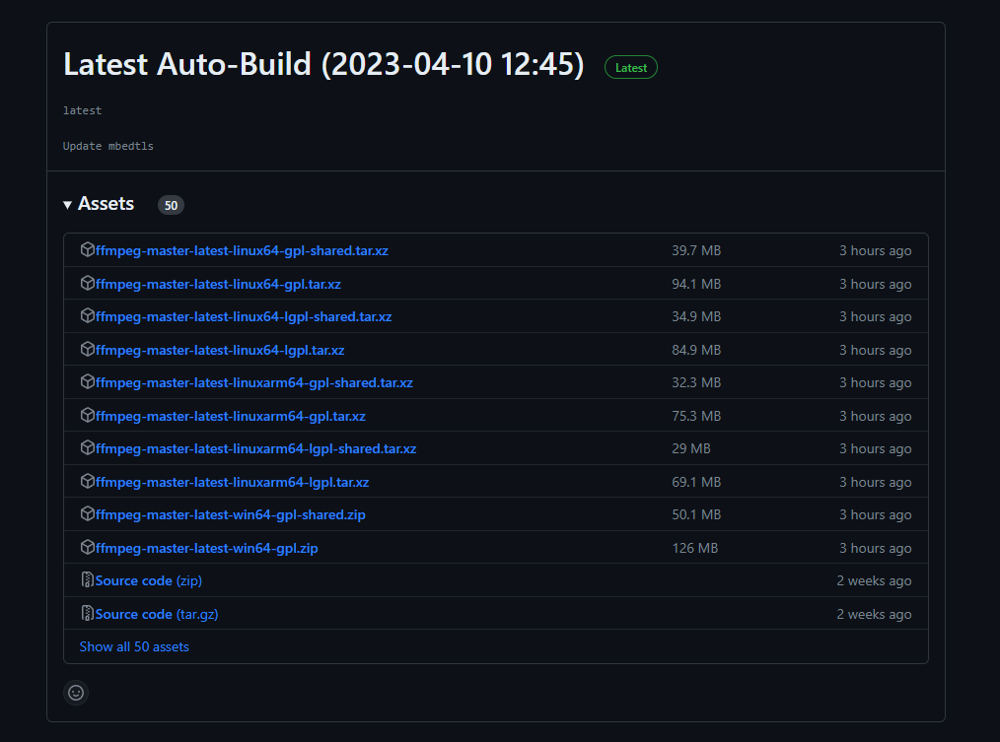
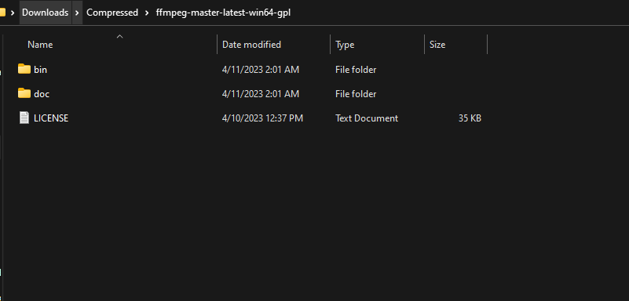
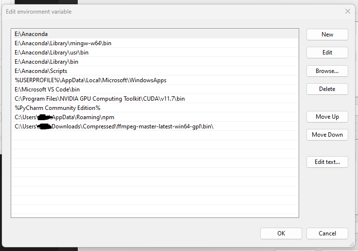
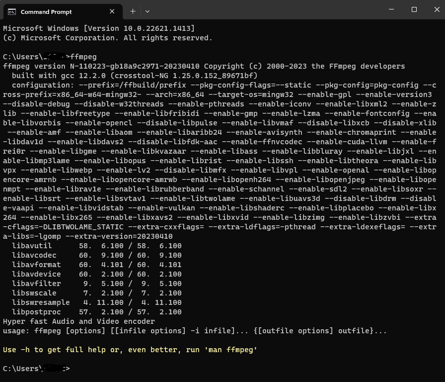

## This is the documentation of Annotation Helper Tool

### Directory 
***
``` 
webapp
├── static
│   ├── css                     
│   ├── scripts                       
│   │   ├── action.js                        
│   │   ├── line.js                        
│   │   ├── line_move.js                        
├── templates                    
│   ├── index.html                     
├── app.py                            
├── readme.md                           
├── requirements.txt                    
                            
```
<br>

### Installation

***
#### Instaling FFMPEG

1. ffmpeg-python is a wrapper package that runs ffmpeg from CLI with subprocess, so you need to download the main body separately and pass it through the PATH.

2. Download the installer from the official site https://github.com/BtbN/FFmpeg-Builds/releases **ffmpeg-master-latest-win64-gp.zip** and



3. Expand the compressed file you dropped into an appropriate folder, and copy the PATH to the bin folder.



4. Add the copied path to PATH variable



5. Now verify by running ffmpeg in terminal



***
6.First create a virtual environment using PIP (For **Windows** system)
- if pip is not up-to-date
```
python -m pip install --upgrade pip                 # upgrade pip
python -m pip install --user virtualenv             # installing virtualenv
```
- creating a virtual environment. It will create an environment named env in the project folder
```
python -m venv env                                  #(env is the name of the env)
```
- activate the virtual environment
```
.\env\Scripts\activate
```
- now install the dependencies
```
pip install -r requirements.txt
```

if the installation is successful now you can run the code.

<br>


### Commands
***
```
python app.py
```


The whole process has been verified multiple times in Windows 10, and Windows 11 device.
